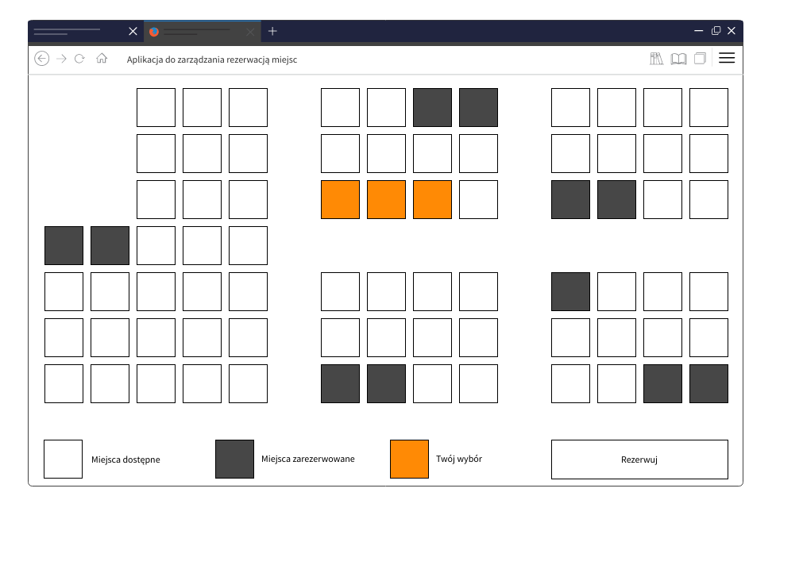

## Seat reservation management application


The goal of the task is to create a web application, using flux architecture and any existing design system of your choice ( e.g. ant.design )

- [x] Aplication started with create-react-app my-app --template redux
- [x] Coverage of key functionalities with testing
- [x] The application should ask for the number of seats to be reserved and whether the seats should be next to each other
- [x] The use of external endpoints has been replaced with a local .json to make it easier to use

<details><summary>SHOW DATA</summary>
<p>

#### Example json first element

``` javascript
 const seat = {
  id: "s01",
  cords: {
   x: 0,
   y: 1
  },
  reserved: false
}
 ```

</p>
</details>

- [x] If you have selected the option that the seats are to be next to each other, the application proposes such seats that are not separated by an empty space and another already reserved seat

- [x] The room view is clickable , it is possible to edit and reselect seats. The user confirms the operation with the Reserve button. The application status is stored locally.

- [x] At the end, a summary page is displayed

### Mockup pages
<details><summary>HOMEPAGE</summary> 
</img>
</details>
<details><summary>ROOM</summary> 
</img>
</details>
<details><summary>SUMMARY</summary> 
</img>
</details>

### Tests results in cypress 10.5
<details><summary>HOMEPAGE</summary> 
</img>
</details>
<details><summary>ROOM</summary> 
</img>
</details>
<details><summary>SUMMARY</summary> 
</img>
</details>

If you want use tests please clone this app to your local repo and install cypress 10.5 with  
npm install cypress
then npm run start   on localhost:3000
and in /seatbook run   npx cypress open

